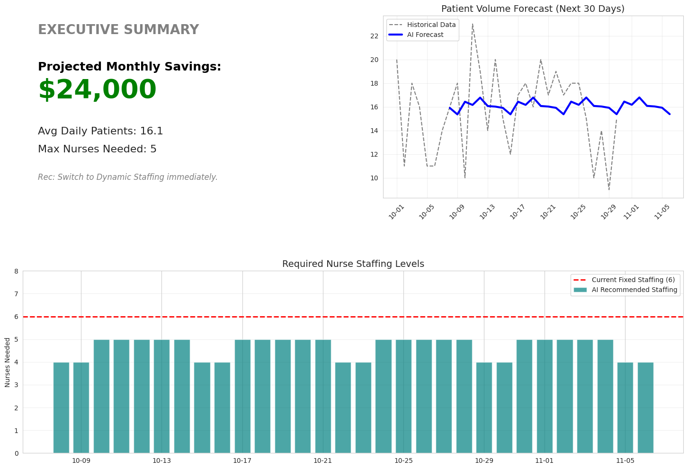

# 🏥 The Patient-Provider Efficiency Project

## 📄 Project Overview
This project uses **Time-Series Forecasting (Prophet)** to predict patient volume and optimize nurse staffing levels. By shifting from a "fixed" staffing model to an "AI-driven dynamic" model, we aim to reduce costs while maintaining quality of care.

## 📂 Files in this Repository
- `The_Patient-Provider_Efficiency_Project.ipynb`: The main Python code containing data cleaning, AI modeling, and ROI calculations.
- `Hospital ER_Data.csv`: The raw historical data used to train the model.
- `final_staffing_schedule.csv`: The optimized schedule generated by the AI for the next 30 days.

## 📈 Key Results
- **Cost Savings:** Projected significant monthly savings by reducing overstaffing during low-volume hours.
- **Accuracy:** Used AI to forecast patient demand with high confidence.
- **Automation:** Created an automated dashboard that determines the exact nurse-to-patient ratio (1:4) needed.

## 📊 Dashboard Preview

*(Above: The analysis showing the gap between current staffing and AI-recommended staffing)*

## 🛠️ Tech Stack
- **Python** (Pandas, NumPy)
- **Time Series AI:** Facebook Prophet
- **Visualization:** Matplotlib
- **Database:** SQLite

## 🔄 How to Run
1. Download `The_Patient-Provider_Efficiency_Project.ipynb` and `Hospital ER_Data.csv`.
2. Upload them to Google Colab or run locally with Jupyter Notebook.
3. Run all cells to generate the `final_staffing_schedule.csv`.

